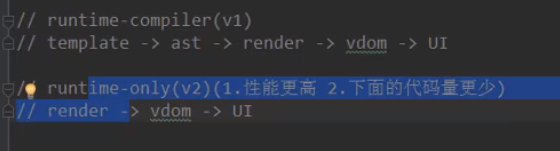

Notes-

Vue-cli command-Line Interface 命令行界面

用于快速搭建Vue开发环境以及对应的webpack配置

在vue-cli3 脚手架基础上可以使用脚手架2的模板，没有必要安装2，

`npm install @vue/cli -g`

`vue --version`

拉取vue-cli2模板

```bash
npm install -g @vue/cli-init
//vue init运行效果会与`vue-cli@2.x`相同
vue init webpack my-progect
//初始化vuecli2项目
vue init webpack my-project
//初始换脚手架3
vue create my-project
```


```shell
#创建一个基于vue-cli2的模板
vue init webpack vuecli2test
#项目名字 默认(vuecli2test)
? Project name (vuecli2test)
#项目描述信息
? Project description (A Vue.js project)
#作者信息，默认显示Git配置的信息
? Author (lemon <freesme@163.com>)
#构建项目选项
? Vue build (Use arrow keys)
#默认运行时编译
> Runtime + Compiler: recommended for most users
#更小，运行效率更高
  Runtime-only: about 6KB lighter min+gzip, but templates (or any Vue-specific HTML) are ONLY allowed in .vue files - render functions are required elsewhere
#是否安装路由  -暂时选择no
? Install vue-router? (Y/n) n
#对ES(JavaScript)代码进行规范，不规范代码编译器报错
? Use ESLint to lint your code? (Y/n) n
#选择Yes会出现 选择规范的标准
> Standard(https://github.com/standard/standard)
  Airbnb(https://github.com/airbnb/javascirpt)
  none(configure it yourself)
#是否添加单元测试
? Set up unit tests (Y/n) n
# e2e end to end 端到端测试 Nightwatch是一个利用selenium或webdriver或hantomjs等进行自动化测试的框架
? Setup e2e tests with Nightwatch? (Y/n) n
#管理项目使用的方式  使用npm
? Should we run `npm install` for you after the project has been created? (recommended) (Use arrow keys)
> Yes, use NPM
  Yes, use Yarn
  No, I will handle that myself


```


Runtime + Compiler:	

template -> ast -> render -> vistual dom -> 真实dom

#更小，运行效率更高
Runtime-only:

render -> vistual dom -> 真实dom





### Vue Cli3

- vue-cli3基于webpack4打造，vue-cli2还是webpack3
- vue-cli3的设计原则是0配置，移除配置文件根目录下的build和config等目录
- vue-cli3提供vue ui功能，提供了可视化配置，更加人性化
- 移除了static文件夹，新增了public文件夹，并且index.html移动到public中

创建cli3项目

`vue create vuecli3test`

```bash
#选择配置
? Please pick a preset: (Use arrow keys)
#默认配置 包含babel eslint
 default (babel, eslint)
#手动配置
>Manually select features
  
? Check the features needed for your project:
 (*) Babel
 ( ) TypeScript
 #先进的 web app
>( ) Progressive Web App (PWA) Support
 ( ) Router
 ( ) Vuex
 ( ) CSS Pre-processors
 (*) Linter / Formatter
 ( ) Unit Testing
 ( ) E2E Testing

? Where do you prefer placing config for Babel, PostCSS, ESLint, etc.? (Use arrow keys)
#独立配置
> In dedicated config files
  In package.json
#保存这些配置作为将来创建项目的模板
? Save this as a preset for future projects? (y/N)


```

