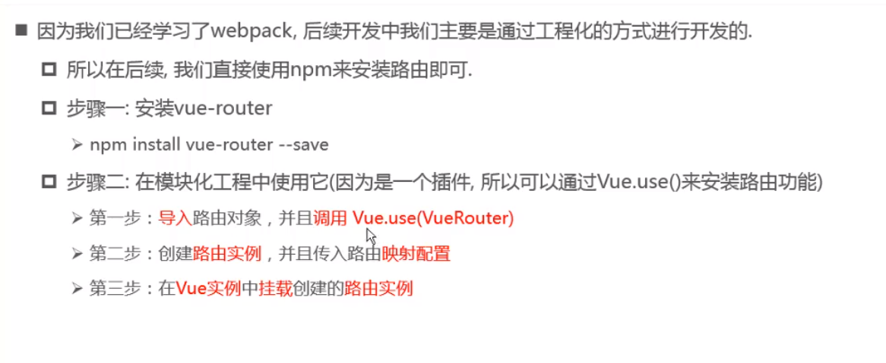
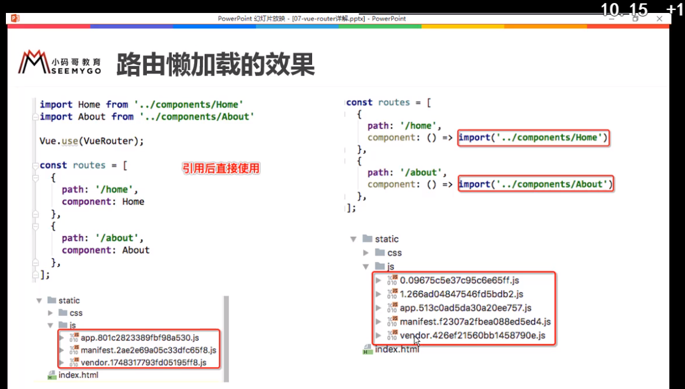
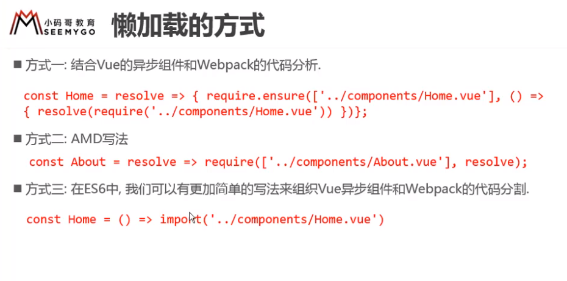
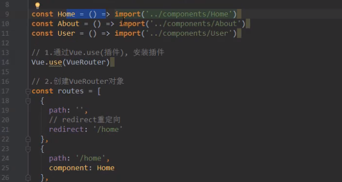

## 路由router

路由就是通过互联的网络把信息从原地址传输到目的地址的活动

- 决定数据包到目的地的路径
- 将输入端的数据转移到合适的输出端
- 路由的本质就是一个映射表，决定了数据的指向

---



### 使用步骤

```javascript
//1.导入路由
import VueRouter from 'vue-router'

//2.通过Vue.use()，安装插件
Vue.use(VueRouter)

//3.创建VueRouter对象
const routers = []
const router = new VueRouter({
  routers
})
//4.导出router对象传入到Vue实例
export default router

```

### 配置路由映射关系

### url的hash和 H5的History模式pushState

改变url但是不刷新页面

`location.hash='aaa'`

或 `history.pushState({},'','url')`

返回上一级

`history.back()`

替换url

history.replaceState()

弹栈 1个

history.go(-1)

history.forward = history.go(1)

---

### 路由懒加载






